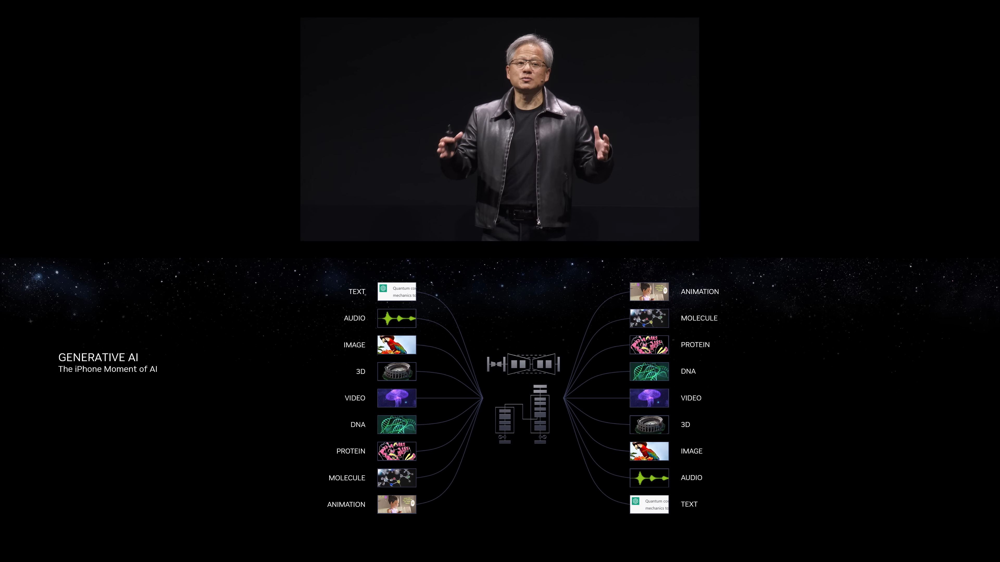

<h1 style="font-size: 2.5rem; font-weight: bold;">AI 概論與實作體驗</h1>
<h1 style="font-size: 5rem; margin-top: 0px; font-weight: bold;">#3 MCU (Ⅱ)</h1>

---
transition: slide-left
layout: top-title
color: dark
---

::title::

<h1 style="font-size: 3rem; padding-top: 10px; padding-bottom: 10px; font-weight: bold;  display: flex; justify-content: space-between;">
   演算法 (Algorithm)解決問題的方法
</h1>

::content::

    

        <h2 style="width: 100%; text-align: left; margin-bottom: 10px;">
            演算法是 AI 的靈魂，也是程式設計的基礎，現今的生成式 AI 利用多模態輸入處理問題，靠的就是分析事件後利用演算法判斷並尋找解法。 
            人類處理事情時腦中其實也在跑演算法，專家系統便是將人腦中的演算法具象化的成品。
        </h2>
    

    

        
        
            NVIDIA Keynote at COMPUTEX 2023 <a href="https://youtu.be/i-wpzS9ZsCs?si=AaSiercHSYeEd4yF&t=2526" target="_blank">Link</a>
        
    

---
transition: slide-left
layout: top-title
color: dark
---

::title::

<h1 style="font-size: 3rem; padding-top: 10px; padding-bottom: 10px; font-weight: bold;  display: flex; justify-content: space-between;">
   補充：演算法能力的標準程式能力檢測/檢定
</h1>

::content::

    

        <h2 style="width: 100%; text-align: left; margin-bottom: 10px;">
            已有明確分級的程式競賽題目來說，CPE 將 UVa 題庫分為 5 個星等，三星題需要能熟練使用進階演算法才能解出，以上次 (2026/05/26) 來說，答題並答對約占考生 1%。 
            或以 APCS 為例，分數標準達到五級代表具備基礎演算法程序運用能力。
        </h2>
    

    

        <iframe 
    src="https://cpe.mcu.edu.tw/cpe/test_data/2026-05-26" 
    width="100%" 
    height="600px" 
    style="border: none;" 
    title="CPE 測試資料 - 2026-05-26">
</iframe>
    

---
transition: slide-left
layout: top-title
color: dark
---

::title::

<h1 style="font-size: 3rem; padding-top: 10px; padding-bottom: 10px; font-weight: bold;  display: flex; justify-content: space-between;">
   今天的目標進階燈泡閃爍實作
</h1>

::content::

    

        

            <h2>第奇數次點亮 LED 時，LED 長亮； 
            第偶數次點亮 LED 時，LED 閃爍。  
            要用到的新知識： 變數 邏輯判斷 防彈跳</h2>  
            
<h2 style="font-size: 2.5rem;">先來學怎麼用按鈕點亮燈</h2>

		

		

			
    	

	

---
transition: slide-left
layout: top-title
color: dark
---

::title::

<h1 style="font-size: 3rem; padding-top: 10px; padding-bottom: 10px; font-weight: bold;  display: flex; justify-content: space-between;">
   認識按鈕開關認識基礎元件
</h1>

::content::

    

        

            <h2>有兩根或四根針腳 (pins) 的版本，當按下按鈕時，兩根的按鈕開關兩根針腳互通，四根針腳的同向互通。 
            因為金屬彈性碰撞與非自鎖式按鈕的特性，通常需要設定防彈跳 (Debounce) 機制解決彈跳問題。</h2>
		

		

			
    	

	

---
transition: slide-left
layout: top-title
color: dark
---

::title::

<h1 style="font-size: 3rem; padding-top: 10px; padding-bottom: 10px; font-weight: bold;  display: flex; justify-content: space-between;">
   按鈕開關開燈實作簡單的實作 (Ⅱ)
</h1>

::content::

    

        

			<video autoplay loop style="height: auto; width: auto;" src="./public/course2-1.mp4"></video> 
    	

	

---
transition: slide-left
layout: top-title
color: dark
---

::title::

<h1 style="font-size: 3rem; padding-top: 10px; padding-bottom: 10px; font-weight: bold;  display: flex; justify-content: space-between;">
   按鈕開關開燈實作進階按鈕開燈實作
</h1>

::content::

    

        

			<video autoplay loop style="height: auto; width: auto;" src="./public/course2-1.mp4"></video> 
    	

	

